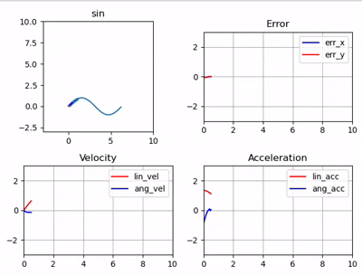

# C++ Model Predictive Control (MPC) Simulation
This is C++ Simple implementation of MPC.
it aims to control a robot to follow a given path (circle, hallway, sine wave)


## Dependencies
* C++14 or higher (not tested lower compiler)
* CMake 3.14 or higher
* Eigen3
* Python2 or Python3 (for visualization)
	* numpy, matplotlib
* [matplotlib_cpp](https://github.com/lava/matplotlib-cpp)

## Build

```bash
git clone https://github.com/mkyun2/Simple_MPC.git
cd Simple_MPC

mkdir build
cd build

cmake ..
make or cmake --build .
```

## Run
```bash
# run simulation with circular path
./simulate circle

# run simulation with hallway path
./simulate hallway

# run simulation with sine wave path
./simulate sin
```
